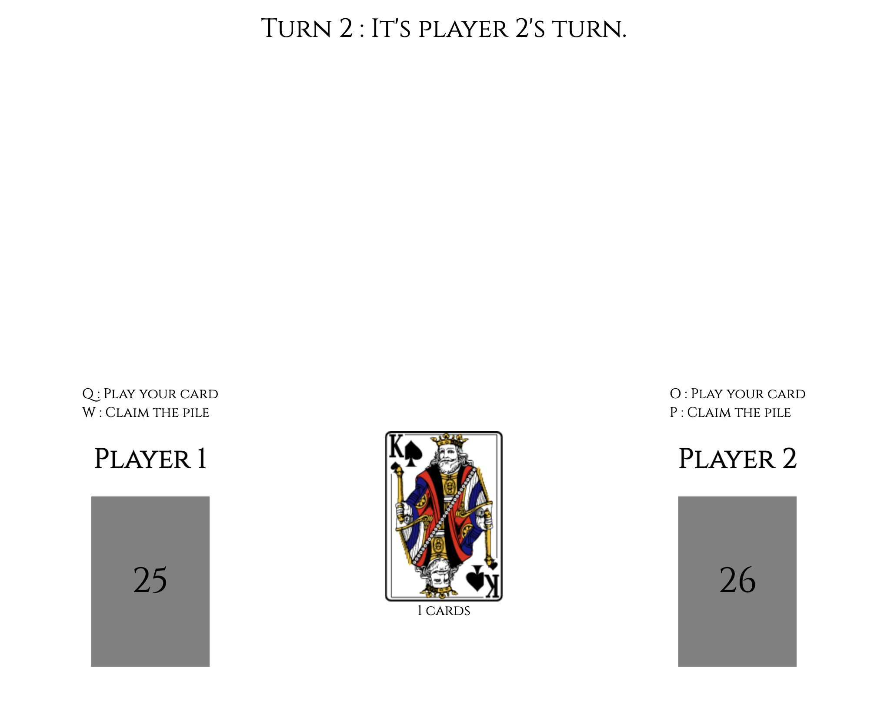

# Connect Four Plugin

A reproduction of the two-players card game "Bataille Corse". Made with vanilla JavaScript in about 2 hours during an exam.

## Game Rules
Players take turn in puting the card at the top of their pile into the middle pile. If two same cards are played in a row, the first player to claim the middle pile wins it. First player to loose all their cards looses the game.

### Things I learned making this project
- DOM Events handling
- JavaScript OOP
- Basic game algorithm making

## Installation
Clone the repo to get started.

Have fun playing the game !
